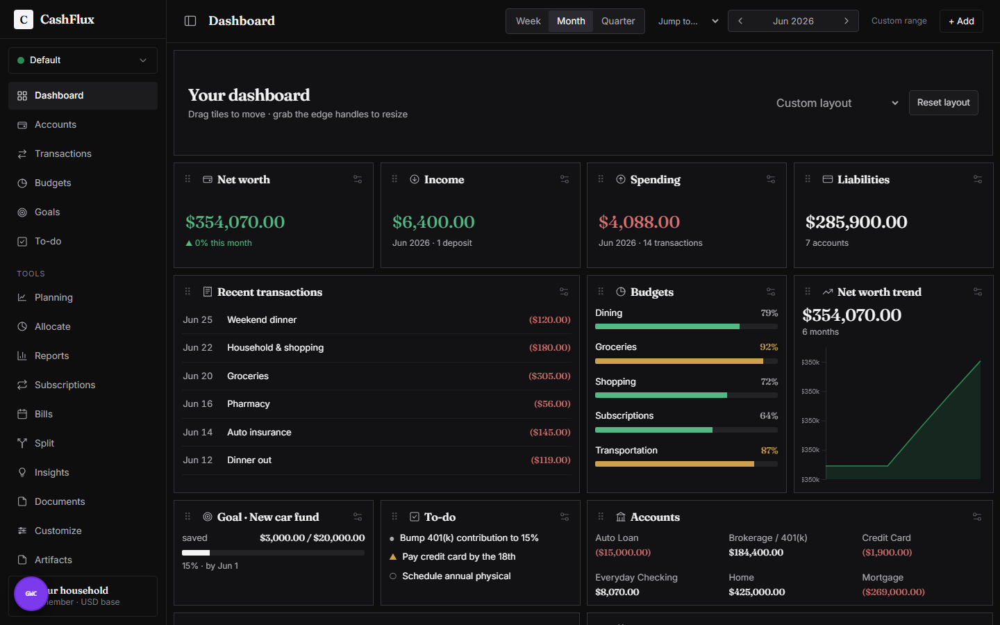
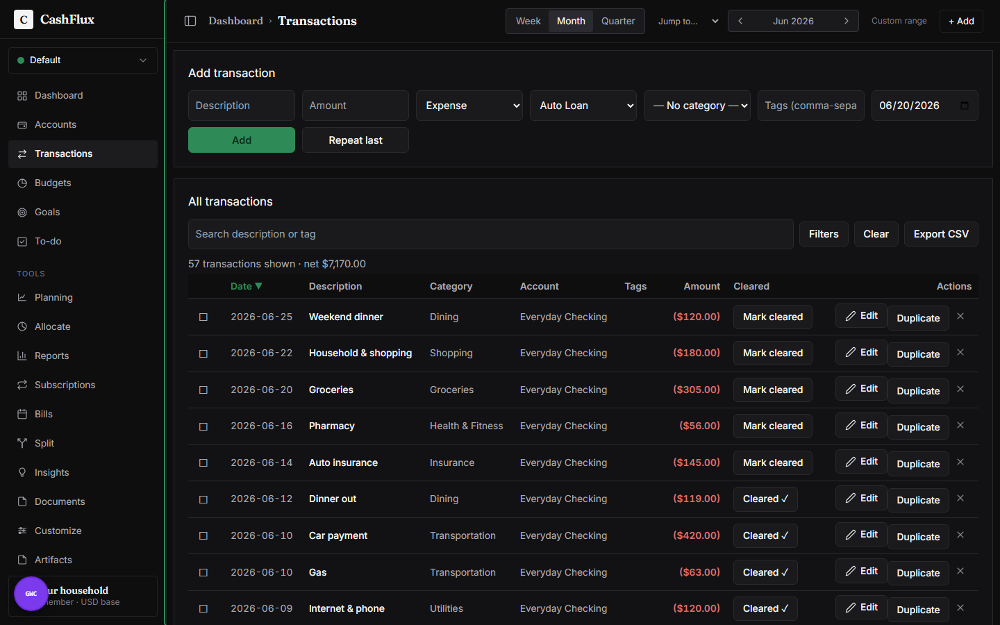
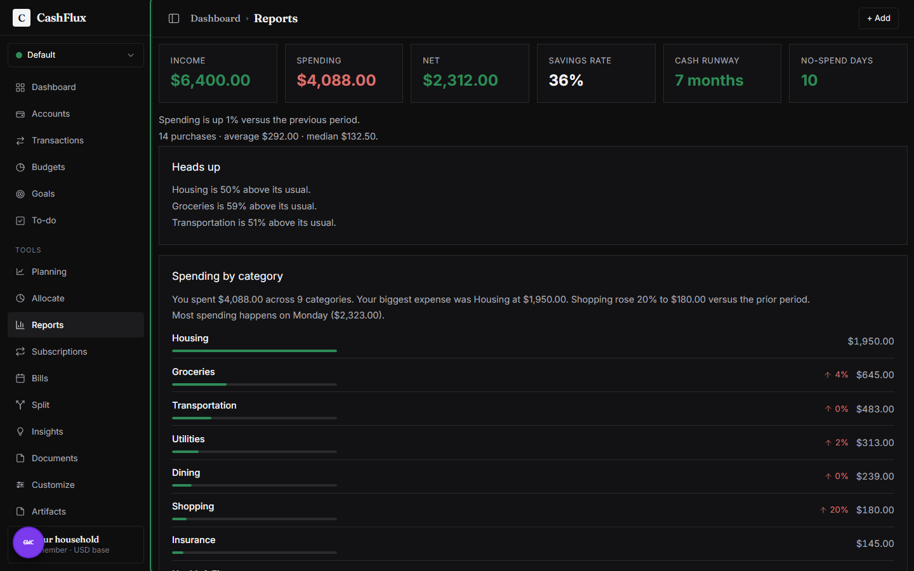
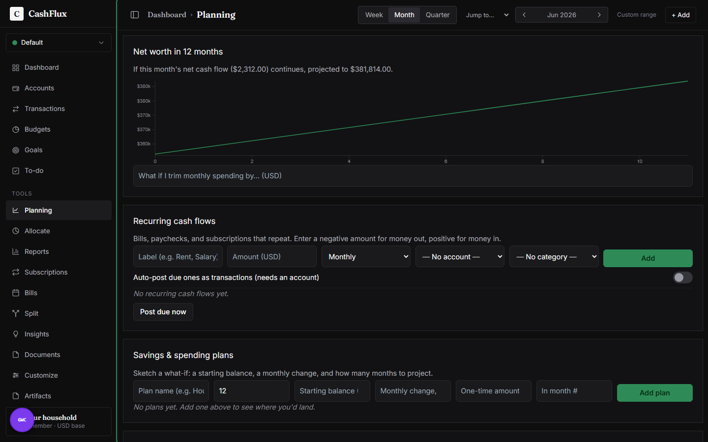
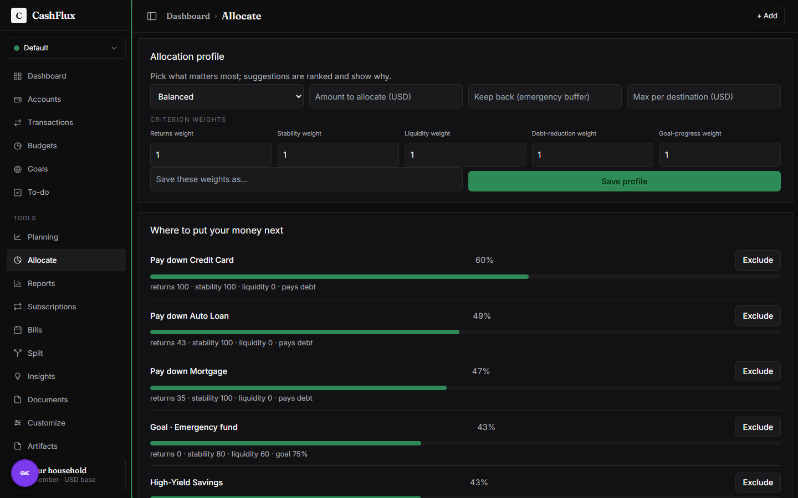

# CashFlux

[](./LICENSE)
[](https://go.dev)
[](https://webassembly.org)
[](https://monstercameron.github.io/CashFlux/)
[](#contributing)
[](./CODE_OF_CONDUCT.md)
[](https://monstercameron.github.io/CashFlux/)
[](https://github.com/monstercameron/GoWebComponents)
[](#-the-fun-part-this-is-pure-go-running-in-your-browser)
[](#-built--maintained-by-ai-agents)
[](./TODOS.md)

A **local-first, household-aware budgeting suite** — accounts, transactions, budgets, goals, planning,
reports, bills, subscriptions, a to-do list, and optional AI insights — that runs **entirely in your
browser** and keeps your money data **on your device**. No account to create. No data sent anywhere
(the only exception is an AI call to OpenAI, and only when *you* click it, with *your own* key).

It's not a toy: **multi-currency** with an FX table, **household-aware** ownership (shared vs per-member),
**zero-based or envelope** budgeting, **snowball/avalanche** debt strategies, **cash-flow forecasting**,
cleared-vs-uncleared **reconciliation**, and a rule that every figure it shows — a budget, a forecast, an
allocation score — can be **traced back to the transactions behind it**. Your spreadsheet, but it does the
math, keeps the receipts, and never phones home.

**▶ Try it now:** **[monstercameron.github.io/CashFlux](https://monstercameron.github.io/CashFlux/)**
— the latest `main`, redeployed on every push. It starts empty; hit **Settings → "Load sample"** to
explore with realistic data. Everything you do stays in your browser's local storage.



> _Screenshots are work-in-progress builds straight off `main` — the app is under active development._

---

## 🤯 The fun part: this is **pure Go running in your browser**

Most web apps are JavaScript (or TypeScript) talking to a server that does the real work. CashFlux
throws that whole layout out.

- **The UI is Go.** Components, state, routing, event handlers — all written in Go, compiled to
  **WebAssembly** (a binary the browser runs natively, like a tiny program). There's basically **no
  hand-written JavaScript**; the screens are Go functions returning a tree of elements.
- **The database is Go, in your tab.** It runs a real **SQLite** engine ([ncruces/go-sqlite3], no C,
  no cgo) *inside the browser*. Your "server" is a SQLite file that never leaves the page.
- **The money math is Go, and it's correct.** Currency, balances, budgets, debt payoff, allocation
  scoring, a sandboxed formula engine — pure, dependency-free Go packages with thorough table-driven
  tests. (Money is stored as integer cents with an explicit currency — never a sloppy float.)
- **The framework is Go too.** It's built on **[GoWebComponents]** (a React-flavored UI framework for
  Go/WASM — hooks, a virtual-DOM-ish renderer, a router), one of my other projects (see below).

So the "backend," the "frontend," and the "database" are **the same language, in one binary, on the
client.** If you've only ever seen Go on servers, that's the story worth nerding out about.

> ELI15: imagine your whole bank app — the buttons, the spreadsheet, the calculator — is a single Go
> program the browser downloads once and then runs offline, like a game cartridge. That's this.

[ncruces/go-sqlite3]: https://github.com/ncruces/go-sqlite3
[GoWebComponents]: https://github.com/monstercameron/GoWebComponents

---

## ⚡ Powered by GoWebComponents

> **Write your whole web app in Go. Hooks you already know, types end-to-end, zero JavaScript toolchain.**

[**GoWebComponents (GWC)**][GoWebComponents] is the Go + WebAssembly UI framework CashFlux is built on —
and CashFlux is its largest real-world proving ground. If you've written React, you already know how to
use it:

- 🪝 **A real hook model** — `UseState`, `UseEffect`, `UseEvent`, `UseRef`, reducers, plus app-wide
  `state` atoms and computed values.
- 🏷️ **Typed HTML, no template language** — a Go `html`/`shorthand` DSL with control-flow helpers
  (`If`, `Map`, `MapKeyed`, `Switch`) that compile-check your markup.
- 🧭 **Batteries included** — client-side router, shared state, `fetch`/WebSocket hooks, i18n, a11y
  primitives, PWA, SSR + hydration, feature flags, and devtools — one Go module.
- 🔗 **Shared types client ↔ server** — the same structs everywhere; no DTO drift, no codegen dance.
- 🚫 **No npm, no bundler** — `go build` is your build step. That's the whole toolchain.

```go
package main

import (
	. "github.com/monstercameron/GoWebComponents/html/shorthand"
	"github.com/monstercameron/GoWebComponents/ui"
	"github.com/monstercameron/GoWebComponents/utils"
)

// A self-contained, stateful component — written in Go, compiled to WebAssembly.
// No JSX, no bundler, no node_modules.
func Counter(start int) ui.Node {
	count := ui.UseState(start)
	inc := ui.UseEvent(Prevent(func() {
		count.Update(func(n int) int { return n + 1 })
	}))

	return Div(Class("card"),
		H2(Class("card-title"), "Clicks"),
		P(Textf("You clicked %d times.", count.Get())),
		If(count.Get() >= 10, P(Class("muted"), "🔥 you're on a roll")),
		Button(Class("btn btn-primary"), Type("button"), OnClick(inc), "Click me"),
	)
}

func main() {
	ui.Render(ui.CreateElement(func() ui.Node { return Counter(0) }), "#app")
	utils.WaitForever()
}
```

That's a complete, interactive component — state, events, conditional rendering — in pure Go. Ship it to
the browser with one `GOOS=js GOARCH=wasm go build`.

**→ Star it / build with it: [github.com/monstercameron/GoWebComponents][GoWebComponents]**

---

## Screenshots

| Transactions | Reports |
|---|---|
|  |  |
| **Planning** | **Allocate** |
|  |  |

_(Want fresh ones? Run the dev server and `node e2e/readme_shots.mjs` — it drives a headless browser
and writes these into `docs/screenshots/`.)_

---

## What it does

- **🧱 Reconfigurable bento dashboard** — drag to reorder, grab the edges to resize, auto-layout modes,
  and your arrangement is remembered. Tiles for net worth, income/spending, budgets, goals, to-do,
  accounts, cash-flow + net-worth trend charts, savings rate, spending breakdown, upcoming bills, and
  smart "stale balance" / spending nudges.
- **💳 Accounts** — assets and liabilities with live balances, net worth, archive/restore, staleness
  badges + "mark updated", reconcile-to-statement, credit utilization, and reassign-on-delete safety.
- **🧾 Transactions** — income, expense, and paired account-to-account transfers; tags; rule-based
  auto-categorization (with suggestions learned from your history); bulk edit/clear/recategorize;
  duplicate detection; CSV export.
- **📊 Budgets · Goals · To-do** — period-aware budgets (week/month/quarter) with near/over health and
  pace projection; savings goals with contributions, pace, and linked accounts; tasks with priority,
  due dates, and notes.
- **🔭 Planning** — debt-payoff calculator (with extra-payment + snowball-vs-avalanche), recurring
  cash-flow manager, what-if plans, and a net-worth forecast.
- **⚖️ Allocate** — ranks *where to put new money* (accounts, high-interest debts, goals) by a profile
  you tune, with a transparent per-criterion breakdown (no black boxes) and an optional AI explanation.
- **📈 Reports** — income/spend/net, savings rate, cash runway, spending-by-category vs last period,
  top payees, biggest expenses, by-member, and trend charts — all from the same tested core, so the
  numbers always agree.
- **🔁 Subscriptions & Bills** — auto-detected recurring charges with price-change alerts and a renewal
  calendar; upcoming bills derived from your liabilities.
- **🤝 Split** — a shared-expense / "who owes whom" calculator for households.
- **🪄 Documents & AI** *(bring-your-own OpenAI key, client-side)* — import CSV, or **snap a photo of a
  receipt/statement and let vision AI extract the line items** for review; "Explain my month"; plain-
  English Q&A; save insights as tasks.
- **⚙️ Workflows** — lightweight automations (trigger → condition → actions) with a dry-run preview.
- **🌍 Multi-currency & household** — hold accounts in different currencies, set a base, and everything
  aggregates through an editable FX table; assign entities to the household or to individual members and
  see **net worth per owner**.
- **🧮 Budgeting your way** — zero-based ("give every dollar a job", with a to-assign banner) or envelope
  (carry balances forward) methodologies, weekly/monthly/quarterly periods, rollover, and parent-category
  roll-ups.
- **🎨 Make it yours** — a real theming engine (Paper / Forest / Midnight + custom), light/dark,
  density + text-scale, **custom fields** on any entity, **custom pages** with widgets, and a sandboxed
  **formula calculator** so power users can define their own metrics over live figures.
- **🔔 Notifications & reminders** — a client-side rules engine (bill-due, budget-threshold, stale-balance,
  goal-milestone, large-transaction, digests) with quiet hours, dedupe, and catch-up-on-open.
- **📦 Yours to keep** — lossless **JSON/CSV import & export**; no lock-in, no proprietary blob. The export
  *is* the sync payload.
- **📱 PWA** — installable, offline-capable (service worker), keyboard-friendly, accessible, and fast.

---

## 🧠 What it believes (design principles)

- **Local-first.** Your data is yours, on your device, by default. The cloud is opt-in convenience, never a
  requirement to use the app.
- **Deterministic & explainable.** Allocations, forecasts, budgets, and formulas **show their work** — no
  black boxes. Same inputs → same outputs, every time (which is also why they're testable).
- **Money is never a float.** Amounts are integer minor units (cents) with an explicit currency; rounding is
  intentional, not an accident of IEEE-754.
- **Strong core, flexible edges.** Core entities stay strongly typed; flexibility comes from validated custom
  fields and the sandboxed formula engine — never by loosening types into untyped soup.
- **No lock-in.** Everything round-trips to plain JSON/CSV. Leave any time, with all your data.

---

## How it's built (the honest, semi-technical version)

```
Browser tab
 ├─ index.html  → loads one wasm binary
 └─ main.wasm (Go)
     ├─ internal/screens · ui · app · uistate   ← the views (thin shell)
     ├─ internal/store (SQLite, in-tab)          ← persistence
     ├─ internal/appstate                        ← the one validated read/write seam
     └─ pure logic: money · currency · ledger · budgeting · goals · payoff ·
        allocate · forecast · formula · rules · reports · …  (no syscall/js, fully tested)
```

The rule we live by: **business logic is platform-independent and table-tested**; the WASM/UI layer is
a *thin* shell that just renders it. So you can run `go test ./...` on native Go and exercise nearly the
whole brain of the app without a browser. Data round-trips through JSON/CSV (lossless import/export),
which doubles as the sync payload.

### Under the hood (for developers)

- **Component + hook model, in Go.** Screens are functions returning a `ui.Node` tree via an `html/shorthand`
  DSL (`Div(Class("x"), …)`). State is `ui.UseState`/`UseEffect` + cross-component `state.UseAtom` atoms;
  a single **data-revision atom** re-renders the app after a store write. (One sharp edge: `On*` handlers
  can't live inside a variable-length loop, so each interactive list row is its own component — the pattern
  shows up everywhere.)
- **Single write seam.** UI never touches the DB directly — everything goes through `internal/appstate`,
  the one validated read/write path over `internal/store` (the in-tab SQLite), so invariants hold in one place.
- **Charts without a chart framework.** A pure `chartspec` package describes a chart; a tiny JS shim
  (`web/chart.js`) renders it with D3. Plus a **FLIP-animation shim** so the bento grid glides when tiles
  reflow — both lazy, both service-worker-cached for offline.
- **Reusable component library.** `internal/ui` ships `DataTable` (sortable, paginated), `FilterToolbar`,
  `FlipPanel` (modal), `Widget`, `Segmented`/`Toggle`/`StepperPill`/`ProgressBar`, `Chart`, and more.
- **Theming engine.** Typed design tokens validated for **WCAG AA contrast**, applied as CSS custom
  properties on `:root` — presets + fully custom themes, light/dark, density, and a user text-scale.
- **Batteries included from the framework:** client-side router (clean history routes), i18n, a11y
  primitives, PWA/offline, feature flags, and SSR/hydration hooks — all Go.
- **Tested two ways:** exhaustive **table-driven unit tests** on the pure packages (`go test ./...`, native),
  plus **Playwright "story" e2e** scripts that drive the real wasm app in a headless browser.
- **No npm, no bundler, no JS supply chain.** One `go build` produces the wasm (~6 MB raw, ~5× smaller under
  brotli); the only third-party browser scripts are D3 + tiny shims, all pinned.

### Why Go on the frontend?

- **One language, one type system, end to end** — the same structs model the domain in the UI, the store, and
  (optionally) the sync server. No DTO translation layer, no client/server drift.
- **Your business logic is actually unit-testable** — money, budgets, payoff, allocation, forecasting all run
  and assert on native Go, not in a flaky browser harness.
- **No JS dependency churn** — no `node_modules`, no transitive supply-chain surface, no build-tool treadmill.
- **The trade-off, stated honestly:** the wasm bundle is bigger than a hand-tuned React app and first paint
  costs a download. For a data-dense, offline-capable, privacy-first finance tool, we think that's a great deal.

### Build & run

```sh
# Inner loop (live reload):
./.tools/gwc.exe dev -app ./main.go -root .

# Build the wasm bundle:
GOOS=js GOARCH=wasm go build -o ./web/bin/main.wasm .

# Test the pure logic (the UI/WASM packages are build-tagged out of native):
go test ./...
```

Serve `web/` (it has `index.html`, the manifest, and the service worker) with the bundle in `web/bin/`.

### Hosting (SPA history fallback)

Clean (non-hash) routes mean a static host must **rewrite unknown non-asset paths to `index.html`**,
or a deep link / refresh at e.g. `/accounts` 404s before the app loads.

- **GitHub Pages:** the deploy workflow generates a `404.html` copy of the shell — automatic here.
- **Netlify:** `/* /index.html 200` in `_redirects`. **Vercel:** rewrite `/(.*)` → `/index.html`.
- **nginx:** `try_files $uri $uri/ /index.html;` · **Caddy:** `try_files {path} /index.html`.

The installed/offline PWA is already covered (the service worker serves the cached shell).

### Optional self-hosted backend

Local-first by default — but there's an **optional** Go backend for multi-device sync and an encrypted
BYO-OpenAI-key proxy. The browser talks to it through a **[GoGRPCBridge]** `/grpc` tunnel (AI calls are
never plain browser HTTP routes). See [`docs/SELF_HOSTING.md`](./docs/SELF_HOSTING.md) for the Docker
Compose quickstart, TLS, backup/restore, and optional OAuth.

[GoGRPCBridge]: https://github.com/monstercameron/GoGRPCBridge

---

## 🤖 Built & maintained by AI agents

CashFlux is a **100% agent-authored** codebase — every line of Go, every test, every doc was written by AI
coding agents under human direction. It's an ongoing experiment in how far disciplined, spec-driven agent
development can go on a real, non-trivial product (multi-currency finance, a from-scratch WASM UI, a tested
logic core).

That continues into maintenance: **issues, pull requests, and feature requests are triaged and implemented
by [Claude](https://www.anthropic.com/claude-code) and [Codex](https://openai.com/codex/) agents**, with a
human in the loop steering and approving. So:

- **File issues like you would anywhere** — clear, reproducible reports are what the agents act on best
  (steps, screen, expected vs actual; the live demo + "Load sample" makes this easy).
- **Human PRs are still welcome** — they're reviewed the same way (and may be refined by an agent before merge).
- The engineering bar in [`CLAUDE.md`](./CLAUDE.md) is literally the agents' rulebook — it's why the logic
  is pure, tested, and built bottom-up.

It's open source and MIT — fork it, learn from it, or just enjoy watching agents ship a finance app in public.

## Contributing

**Yes please — PRs, issues, and feature requests are all welcome.**

- 🐛 **Found a bug?** [Open an issue](https://github.com/monstercameron/CashFlux/issues) with steps
  to reproduce (the live demo + "Load sample" makes this easy).
- 💡 **Want a feature?** File a feature-request issue — the roadmap lives in
  [`TODOS.md`](./TODOS.md), so you can see what's already planned and pile on.
- 🔧 **Sending a PR?** Read [`CLAUDE.md`](./CLAUDE.md) first — it's the engineering bar in one page
  (pure idiomatic Go, table-tested logic, one feature per commit, `gofmt`/`go vet` clean). Build
  bottom-up: data model → tested logic → persistence → state → UI last.

Good first issues tend to live in the pure logic packages (no browser needed — just `go test`).

## Built on (my other projects)

- **[GoWebComponents][GoWebComponents] (GWC)** — the Go/WASM UI framework above; CashFlux is its biggest
  real-world workout.
- **[GoGRPCBridge][GoGRPCBridge] (GRPCbridge)** — the tunnel that lets the browser app talk to the
  optional backend over a single `/grpc` endpoint (clean auth boundary, no sprawl of HTTP routes).

If the "pure Go on the frontend" idea is your jam, those two repos are where the magic lives.

## Business model (upcoming)

CashFlux is, and will stay, **free and open-source for local use** (MIT) — the whole app runs on your
device with no account required, forever. **Self-hosting the backend is always free** too.

The plan for sustainability is a simple, opt-in **hosted tier** for people who want the conveniences a
pure-local app can't do alone:

- **Multi-device sync** (your one household dataset, end-to-end, across phone + laptop).
- **Managed AI** (insights / receipt scanning without juggling your own API key) and a metered cost view.
- **Reminders that reach you when the app is closed** (email / SMS / push) — which genuinely needs a
  server to run the schedule.

The deal: **local + self-host stays free; the cloud tier is purely a convenience you can take or
leave.** No paywalling your own data, no ads, no selling anything. (Details and pricing are still being
worked out — watch the repo.)

## Docs

- **[`docs/GETTING_STARTED.md`](./docs/GETTING_STARTED.md) — add components & pages (start here to build)**
- [`CONTRIBUTING.md`](./CONTRIBUTING.md) · [`CODE_OF_CONDUCT.md`](./CODE_OF_CONDUCT.md) · [`SECURITY.md`](./SECURITY.md)
- [`SPEC.md`](./SPEC.md) — product spec · [`TODOS.md`](./TODOS.md) — roadmap/backlog
- [`CLAUDE.md`](./CLAUDE.md) — engineering rules · [`docs/GOWEBCOMPONENTS.md`](./docs/GOWEBCOMPONENTS.md) — framework notes
- [`CHANGELOG.md`](./CHANGELOG.md) / [`DEVLOG.md`](./DEVLOG.md) — history & decisions

## License

[MIT](./LICENSE) — © 2026 monstercameron. Do what you like with it; keep the copyright notice.
